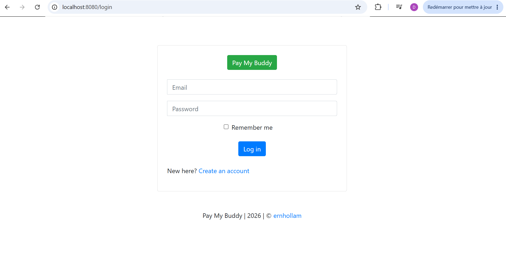
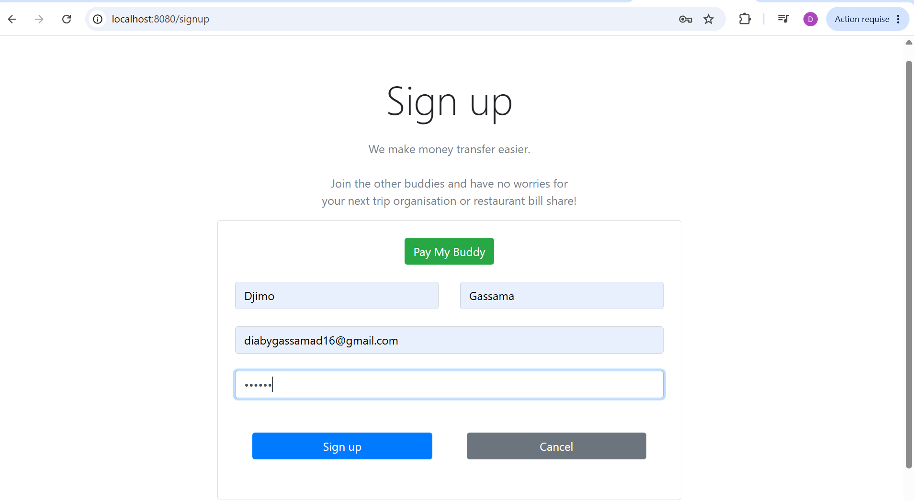
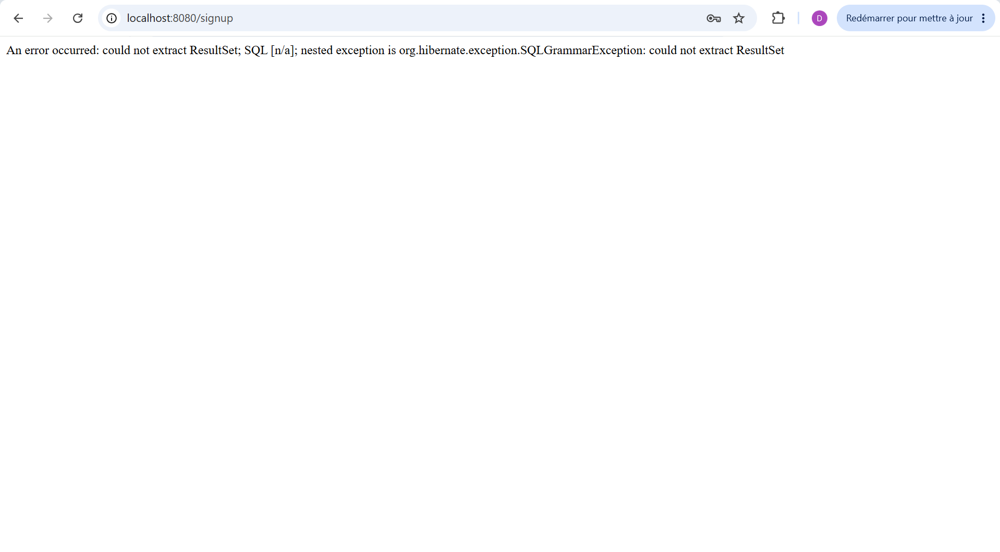
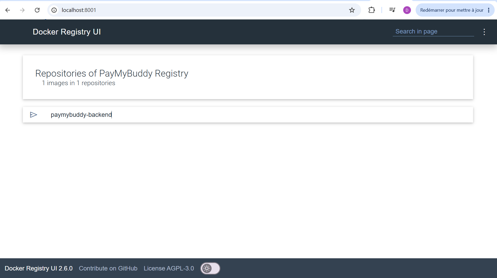
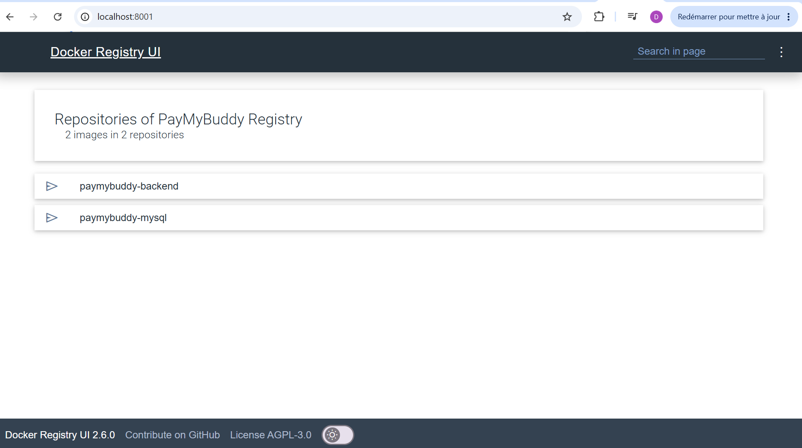
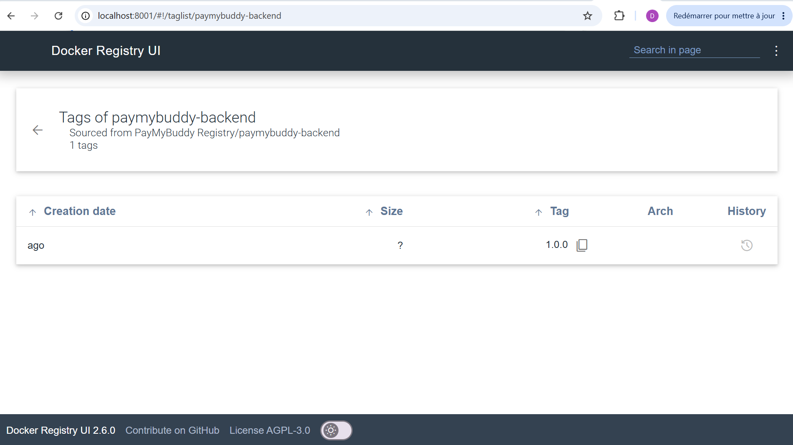
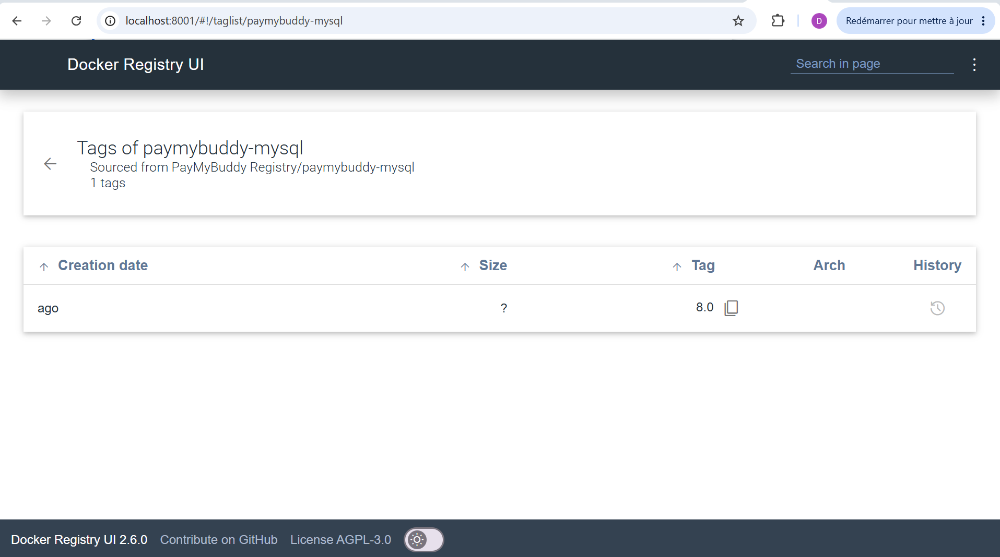

# PayMyBuddy - Application de Transactions Financières 💰



**PayMyBuddy** est une application web complète permettant aux utilisateurs de gérer facilement des transactions financières entre amis. Le projet démontre les meilleures pratiques de containerisation avec Docker et d'orchestration avec Docker Compose.

---

## 📋 Table des matières

- [Vue d'ensemble](#vue-densemble)
- [Architecture](#architecture)
- [Prérequis](#prérequis)
- [Installation et Démarrage](#installation-et-démarrage)
- [Commandes essentielles](#commandes-essentielles)
- [Configuration](#configuration)
- [Aperçus de l'application](#aperçus-de-lapplication)
- [Structure du projet](#structure-du-projet)
- [Technologies utilisées](#technologies-utilisées)
- [Caractéristiques](#caractéristiques)

---

## 🎯 Vue d'ensemble

**PayMyBuddy** est une plateforme de gestion de transactions financières entre amis avec une architecture containerisée. Ce projet démontre :

✅ La dockerisation complète d'une application Spring Boot  
✅ L'orchestration multi-conteneurs avec Docker Compose  
✅ La gestion des volumes et des réseaux Docker  
✅ Les bonnes pratiques de sécurité (variables d'environnement, healthchecks)  
✅ L'intégration d'une base de données MySQL persistante  
✅ Les tests unitaires avec couverture JaCoCo  

---

## 🏗️ Architecture

L'application utilise une architecture multi-conteneurs :

```
┌─────────────────────────────────────────┐
│        PayMyBuddy Application           │
├─────────────────────────────────────────┤
│                                         │
│  ┌──────────────────────────────────┐  │
│  │   Backend (Spring Boot)          │  │
│  │   Port: 8080                     │  │
│  │   - Gestion des utilisateurs     │  │
│  │   - Gestion des transactions     │  │
│  │   - Authentification & Sécurité  │  │
│  │   - API REST                     │  │
│  └──────────────────────────────────┘  │
│           ↓ (JDBC/MySQL)                │
│  ┌──────────────────────────────────┐  │
│  │   Base de données (MySQL 8.0)    │  │
│  │   Port: 3306                     │  │
│  │   - Utilisateurs                 │  │
│  │   - Transactions                 │  │
│  │   - Comptes bancaires            │  │
│  │   - Connexions entre amis        │  │
│  └──────────────────────────────────┘  │
│                                         │
└─────────────────────────────────────────┘
```

### 🔧 Composants

| Composant | Technologie | Rôle |
|-----------|-------------|------|
| **Backend** | Spring Boot 2.7.1 | API REST et logique métier |
| **Frontend** | Thymeleaf + HTML/CSS | Interface utilisateur |
| **Base de données** | MySQL 8.0 | Stockage persistant |
| **Sécurité** | Spring Security | Authentification et autorisation |
| **ORM** | Spring Data JPA | Accès aux données |
| **Tests** | JUnit 5 + Mockito | Tests unitaires |
| **Couverture** | JaCoCo | Analyse de couverture de code |

---

## 📦 Prérequis

- **Docker** (v20.10+)
- **Docker Compose** (v1.29+)
- **Java 17** (optionnel, pour le développement local)
- **Maven 3.6+** (optionnel, pour le développement local)
- **Git**

### Vérifier les installations

```bash
docker --version
docker-compose --version
```

---

## 🚀 Installation et Démarrage

### 1️⃣ Cloner le repository

```bash
git clone <repository-url>
cd mini-projet-docker
```

### 2️⃣ Construire l'application

```bash
# Compiler avec Maven et créer le fichier JAR
mvn clean package

# Cela génère : target/paymybuddy.jar
```

### 3️⃣ Créer le fichier de configuration (.env)

```bash
# Créer un fichier .env à la racine du projet
cat > .env << EOF
# Configuration de la base de données
MYSQL_ROOT_PASSWORD=rootpassword
MYSQL_DATABASE=paymybuddy
MYSQL_USER=paymybuddy_user
MYSQL_PORT=3307

# Configuration de l'application
APP_PORT=8080
APP_VERSION=1.0.0

# Registry Docker (optionnel)
REGISTRY_HOST=localhost:5000
EOF
```

### 4️⃣ Démarrer l'application avec Docker Compose

```bash
# Démarrer tous les services en arrière-plan
docker-compose up -d

# Suivre les logs en temps réel
docker-compose logs -f

# Vérifier le statut des services
docker-compose ps
```

### 5️⃣ Accéder à l'application

- **URL de l'application:** [http://localhost:8080](http://localhost:8080)
- **Base de données:** `localhost:3307` (accès direct sur le port spécifié dans .env)

---

## 📟 Commandes essentielles

### 🐳 Docker Compose - Gestion de l'application

```bash
# ✅ Démarrer les services
docker-compose up -d

# ✅ Arrêter les services
docker-compose down

# ✅ Arrêter et supprimer les volumes
docker-compose down -v

# ✅ Voir l'état des services
docker-compose ps

# ✅ Voir les logs en direct
docker-compose logs -f

# ✅ Voir les logs d'un service spécifique
docker-compose logs -f paymybuddy-backend
docker-compose logs -f paymybuddy-db

# ✅ Redémarrer un service
docker-compose restart paymybuddy-backend

# ✅ Exécuter une commande dans un conteneur actif
docker-compose exec paymybuddy-backend bash
docker-compose exec paymybuddy-db mysql -uroot -p$MYSQL_ROOT_PASSWORD

# ✅ Reconstruire l'image du backend
docker-compose build --no-cache paymybuddy-backend

# ✅ Reconstruire et redémarrer
docker-compose up -d --build
```

### 🏗️ Maven - Développement et build

```bash
# ✅ Compiler le projet
mvn clean compile

# ✅ Compiler et builder le JAR
mvn clean package

# ✅ Builder sans exécuter les tests
mvn clean package -DskipTests

# ✅ Exécuter les tests unitaires
mvn test

# ✅ Exécuter les tests avec couverture JaCoCo
mvn clean test jacoco:report

# ✅ Voir le rapport de couverture (dans target/site/jacoco/index.html)

# ✅ Exécuter l'application localement
mvn spring-boot:run

# ✅ Nettoyer les fichiers compilés
mvn clean
```

### 🐘 Docker - Gestion des images

```bash
# ✅ Lister les images
docker images

# ✅ Lister les conteneurs
docker ps
docker ps -a

# ✅ Supprimer une image
docker rmi paymybuddy-backend

# ✅ Supprimer les images non utilisées
docker image prune

# ✅ Inspecter les logs d'un conteneur
docker logs -f paymybuddy-backend

# ✅ Copier un fichier d'un conteneur
docker cp paymybuddy-backend:/app/app.jar ./backup/

# ✅ Tagger une image pour le registry
docker tag paymybuddy-backend:latest localhost:5000/paymybuddy-backend:1.0.0

# ✅ Pousser vers le registry
docker push localhost:5000/paymybuddy-backend:1.0.0
```

### 🔍 Dépannage

```bash
# ✅ Vérifier l'état des services
docker-compose ps

# ✅ Voir les logs détaillés
docker-compose logs paymybuddy-backend

# ✅ Vérifier la santé d'un service
docker-compose ps paymybuddy-db

```

---

## ⚙️ Configuration

### Variables d'environnement (.env)

```bash
# Base de données MySQL
MYSQL_ROOT_PASSWORD=rootpassword    # Mot de passe root MySQL
MYSQL_DATABASE=paymybuddy           # Nom de la base de données
MYSQL_USER=paymybuddy_user          # Utilisateur MySQL (optionnel)
MYSQL_PORT=3307                     # Port externe MySQL (mappé sur 3306 interne)

# Application Spring Boot
APP_PORT=8080                       # Port externe de l'application
APP_VERSION=1.0.0                   # Version de l'application

# Docker Registry (pour le déploiement)
REGISTRY_HOST=localhost:5000        # URL du registre Docker
```


### Dockerfile - Construction de l'image

```dockerfile
# Image Java légère basée sur Amazon Corretto 17
FROM amazoncorretto:17-alpine

# Répertoire de travail
WORKDIR /app

# Copier le fichier JAR compilé
COPY target/paymybuddy.jar app.jar

# Exposer le port Spring Boot
EXPOSE 8080

# Lancer l'application
CMD ["java", "-jar", "app.jar"]
```

### docker-compose.yml - Orchestration complète

**Services:**
- **paymybuddy-db:** MySQL 8.0 avec volumes persistants
- **paymybuddy-backend:** Spring Boot avec dépendance de santé

**Fonctionnalités:**
- ✅ Health checks pour MySQL
- ✅ Volumes pour persistance des données
- ✅ Réseau bridge personnalisé
- ✅ Dépendances de services
- ✅ Variables d'environnement sécurisées

---

## 📸 Aperçus de l'application

### Interfaces utilisateur

L'application propose les pages suivantes :

| Page | Capture | Description |
|------|---------|-------------|
| **Inscription** |  | Page d'inscription |
| **Connexion** |  | Formulaire de connexion/authentification |
| **Page d'accueil** |  | Page après connexion |
| **Registry 1** |  | Registry avec l'image 1 |
| **Registry 2** |  | Registry avec l'image 2 avec les 2 image |
| **Details image 1** |  | Détails de l'image 1 |
| **Details image 2** |  | Détails de l'image 2 |

---

## 📁 Structure du projet

```
mini-projet-docker/
├── src/
│   ├── main/
│   │   ├── java/com/paymybuddy/
│   │   │   ├── controller/          # Contrôleurs Spring MVC
│   │   │   ├── service/             # Logique métier
│   │   │   ├── model/               # Entités JPA
│   │   │   ├── repository/          # Interfaces JPA
│   │   │   ├── config/              # Configuration Spring Security
│   │   │   └── PayMyBuddyApplication.java  # Application principale
│   │   └── resources/
│   │       ├── templates/           # Templates Thymeleaf
│   │       │   ├── home.html
│   │       │   ├── login.html
│   │       │   ├── signup.html
│   │       │   ├── profile.html
│   │       │   ├── pay.html
│   │       │   ├── transfer.html
│   │       │   ├── add-connection.html
│   │       │   ├── contact.html
│   │       │   ├── update-balance.html
│   │       │   └── fragments/       # Composants réutilisables
│   │       ├── static/              # Ressources statiques
│   │       │   ├── css/
│   │       │   ├── js/
│   │       │   └── images/
│   │       ├── database/
│   │       │   └── create.sql       # Schéma de la base de données
│   │       └── application.properties
│   └── test/
│       └── java/com/paymybuddy/     # Tests unitaires
│           ├── BankAccountServiceTest.java
│           ├── ConnectionServiceTest.java
│           ├── TransactionServiceTest.java
│           ├── UserServiceTest.java
│           └── PayMyBuddyApplicationTests.java
├── initdb/
│   └── create.sql                   # Scripts d'initialisation MySQL
├── images/                          # Captures d'écran (0-7.png)
├── target/
│   ├── paymybuddy.jar              # Artifact JAR final
│   ├── jacoco.exec                 # Rapport de couverture JaCoCo
│   └── site/jacoco/                # Rapport HTML JaCoCo
├── Dockerfile                       # Construction de l'image Docker
├── docker-compose.yml              # Orchestration multi-conteneurs
├── pom.xml                         # Configuration Maven
├── registry-config.yml             # Configuration du registry Docker
└── README.md                        # Ce fichier

```

---

## 🛠️ Technologies utilisées

### Backend & Framework

| Technologie | Version | Utilisation |
|-------------|---------|-----------|
| **Java** | 17 | Langage principal |
| **Spring Boot** | 2.7.1 | Framework web |
| **Spring Security** | - | Authentification/Autorisation |
| **Spring Data JPA** | - | Accès aux données |
| **Thymeleaf** | - | Moteur de templates |
| **Lombok** | - | Réduction du code |

### Base de données

| Technologie | Version | Utilisation |
|-------------|---------|-----------|
| **MySQL** | 8.0 | Base de données relationnelle |
| **MySQL Connector/J** | - | Driver JDBC |

### Tests & Qualité

| Technologie | Version | Utilisation |
|-------------|---------|-----------|
| **JUnit 5** | - | Framework de tests |
| **Mockito** | - | Mocks pour les tests |
| **JaCoCo** | 0.8.8 | Couverture de code |

### DevOps & Containerisation

| Technologie | Version | Utilisation |
|-------------|---------|-----------|
| **Docker** | 20.10+ | Containerisation |
| **Docker Compose** | 1.29+ | Orchestration |
| **Amazon Corretto** | 17-alpine | Image Java légère |

### Build & Gestion des dépendances

| Technologie | Version | Utilisation |
|-------------|---------|-----------|
| **Maven** | 3.6+ | Gestion du build |
| **Spring Boot Maven Plugin** | - | Construction du JAR |

---

## ✨ Caractéristiques

### 👤 Gestion des utilisateurs
- ✅ Inscription et authentification sécurisées
- ✅ Profils utilisateur personnalisés
- ✅ Gestion des mots de passe avec Spring Security
- ✅ Connexions entre amis

### 💳 Gestion des transactions
- ✅ Transferts d'argent entre amis
- ✅ Historique des transactions
- ✅ Mise à jour du solde bancaire
- ✅ Gestion des comptes bancaires

### 🔒 Sécurité
- ✅ Authentification par formulaire
- ✅ Autorisation basée sur les rôles
- ✅ Protection CSRF
- ✅ Validation des entrées utilisateur
- ✅ Variables d'environnement pour les secrets

### 🐳 Infrastructure
- ✅ Containerisation complète avec Docker
- ✅ Orchestration avec Docker Compose
- ✅ Volumes persistants pour les données
- ✅ Health checks automatiques
- ✅ Support du registry Docker

### 🧪 Tests & Qualité
- ✅ Tests unitaires complets (5 suites de tests)
- ✅ Couverture JaCoCo intégrée
- ✅ Rapports de test détaillés
- ✅ Support des tests JPA

---

## 📝 Notes importantes

### ⚠️ Sécurité en production

1. **Changez les mots de passe par défaut** dans le fichier `.env`
2. **Utilisez Docker Secrets** pour les environnements de production
3. **Activez HTTPS** avec un certificat SSL
4. **Limitez les accès réseau** aux services
5. **Mettez à jour régulièrement** les images de base

### 🔄 Flux de déploiement typique

```bash
# 1. Compilation et tests
mvn clean package

# 2. Construction de l'image
docker-compose build

# 3. Démarrage des services
docker-compose up -d

# 4. Vérification de la santé
docker-compose ps
docker-compose logs -f

# 5. Arrêt propre
docker-compose down
```

---

## 👨‍💻 Développement

### Ajouter une nouvelle dépendance

Puis rebuilder :
```bash
mvn clean package
docker-compose up -d --build
```

### Déboguer l'application

```bash
# Voir les logs en direct
docker-compose logs -f paymybuddy-backend

# Accéder au shell du conteneur
docker-compose exec paymybuddy-backend bash

# Tester la connexion DB
docker-compose exec paymybuddy-backend ping paymybuddy-db
```

---

## 📞 Support

Pour toute question ou problème :

1. Consultez les logs : `docker-compose logs -f`
2. Vérifiez la configuration `.env`
3. Assurez-vous que les ports ne sont pas occupés
4. Vérifiez que Docker Compose est à jour

---

**Dernière mise à jour:** mai 2026  
**Version:** 1.0.0  
**Licence:** MIT

---


