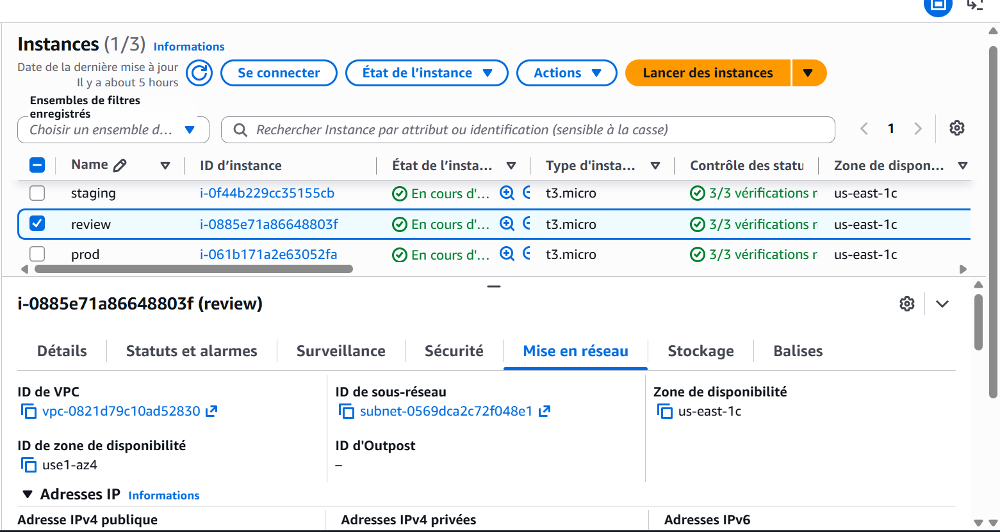
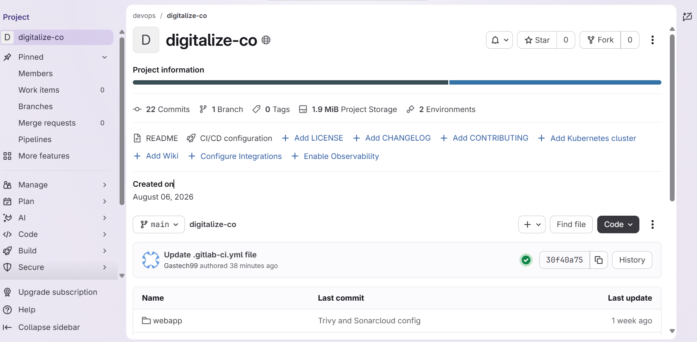
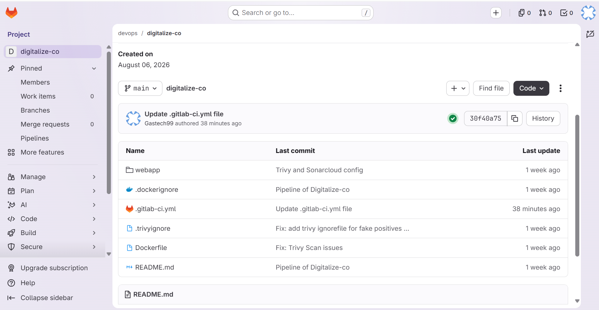
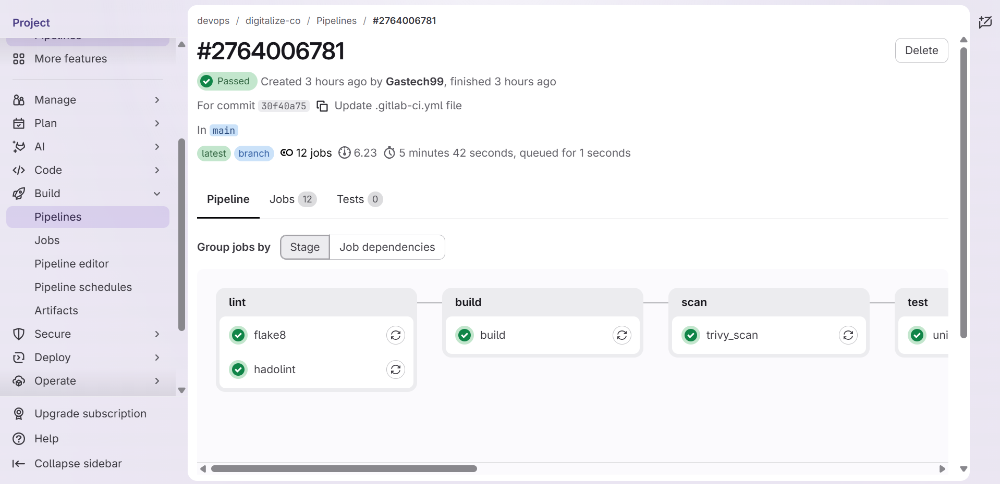
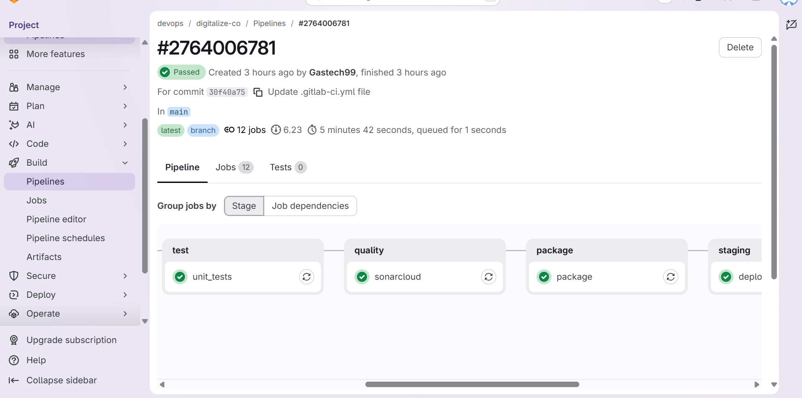
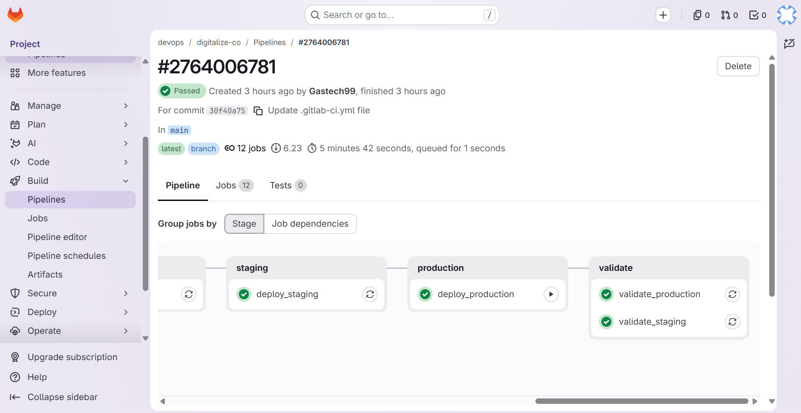
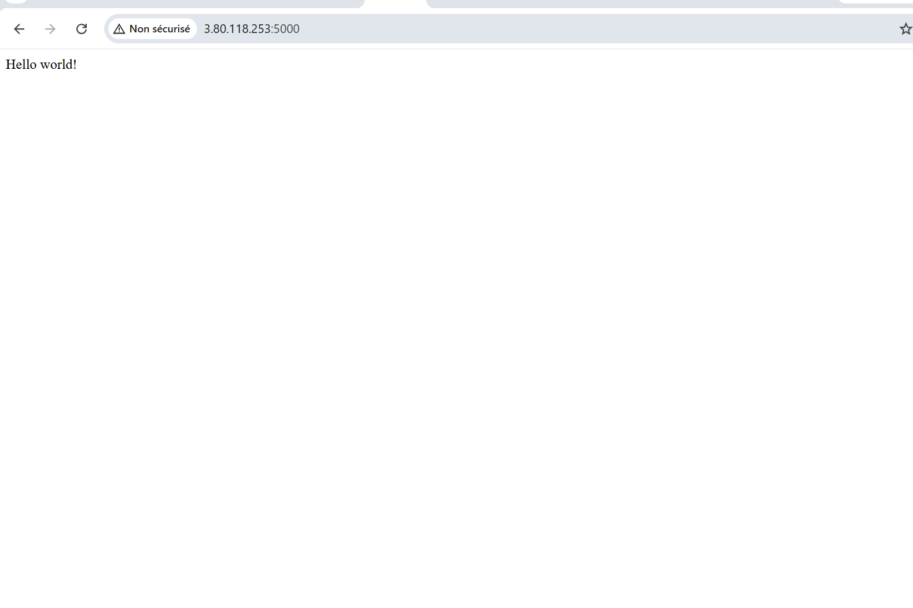
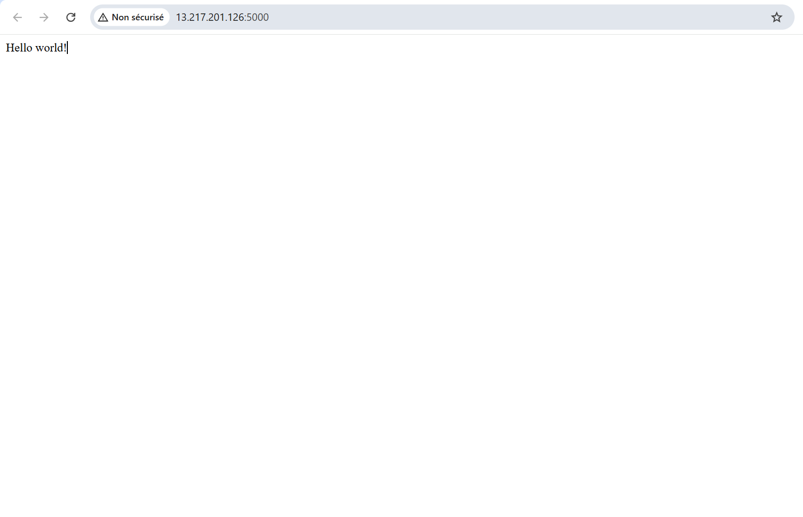

# GitLab CI/CD Pipeline for a Flask Hello World Application
# Pipeline CI/CD GitLab pour une application Flask Hello World

## English

### Project Overview
This project is a simple Flask application that returns the text `Hello world!` and is packaged in a Docker container. It is designed to demonstrate a complete DevOps workflow with GitLab CI/CD, Docker image building, security scanning, unit testing, static quality analysis, and deployment to review, staging, and production environments.

The repository contains:
- a minimal Flask web application in `webapp/`
- a Docker image definition in `Dockerfile`
- GitLab CI/CD configuration in `.gitlab-ci.yml`
- security and quality checks with Trivy and SonarCloud
- deployment jobs via SSH to remote infrastructure

### Project Structure
```text
mini-projet-gitlab-ci/
├── .gitlab-ci.yml
├── .trivyignore
├── .dockerignore
├── Dockerfile
├── README.md
├── images/
│   ├── 00.png
│   ├── 01.png
│   ├── 02.png
│   ├── 03.png
│   ├── 04.png
│   ├── 05.png
│   ├── 06.png
│   └── 07.png
└── webapp/
    ├── app.py
    ├── requirements.txt
    ├── tests.py
    ├── wsgi.py
    └── __pycache__/
```

### Application Behavior
The Flask app exposes a single endpoint:
- `/` -> returns `Hello world!`

### Prerequisites
Before running the project, ensure you have:
- Python 3.11+
- pip
- Docker and Docker Compose
- GitLab CI configured with the required variables

### Run Locally
```bash
cd mini-projet-gitlab-ci
python -m venv .venv
source .venv/bin/activate   # Linux/macOS
# or .venv\Scripts\activate  # Windows
pip install -r webapp/requirements.txt
python webapp/app.py
```
Then open:
```text
http://localhost:5000/
```

### Run with Docker
```bash
docker build -t gitlab-ci-flask-app .
docker run -p 5000:5000 gitlab-ci-flask-app
```
Then access:
```text
http://localhost:5000/
```

### CI/CD Pipeline Overview
The GitLab pipeline includes the following stages:
1. `lint` — Flake8 and Hadolint
2. `build` — Docker image build and push to GitLab Container Registry
3. `scan` — Trivy security scan
4. `test` — Unit tests for the Flask app
5. `quality` — SonarCloud analysis
6. `package` — Tagging and publishing Docker images
7. `review` — deployment to review environment
8. `staging` — deployment on main branch
9. `production` — manual production deployment
10. `validate` — checks after deployment

Required GitLab variables include:
- `SSH_PRIVATE_KEY`
- `REVIEW_SERVER_USER` / `REVIEW_SERVER_HOST`
- `STAGING_SERVER_USER` / `STAGING_SERVER_HOST`
- `PROD_SERVER_USER` / `PROD_SERVER_HOST`
- `SONAR_TOKEN`
- `SONAR_HOST_URL`
- `SONAR_ORGANIZATION`
- `SONAR_PROJECT_KEY`

### Screenshots from the Project
The repository includes screenshots in the `images/` folder, renamed as numbered assets:










### Summary
This project is a compact but realistic example of a containerized Python application integrated into a GitLab CI/CD workflow. It is useful for learning DevOps practices such as Dockerization, automated testing, security scanning, code quality analysis, and deployment automation.

---

## Français

### Vue d’ensemble du projet
Ce projet est une application Flask simple qui renvoie le texte `Hello world!` et qui est empaquetée dans un conteneur Docker. Il a été conçu pour démontrer un workflow DevOps complet avec GitLab CI/CD, construction d’images Docker, analyse de sécurité, tests unitaires, qualité du code et déploiement dans des environnements de review, staging et production.

Le dépôt contient :
- une application web Flask minimale dans `webapp/`
- une définition d’image Docker dans `Dockerfile`
- la configuration GitLab CI/CD dans `.gitlab-ci.yml`
- des contrôles de sécurité et de qualité avec Trivy et SonarCloud
- des jobs de déploiement via SSH vers des infrastructures distantes

### Structure du projet
```text
mini-projet-gitlab-ci/
├── .gitlab-ci.yml
├── .trivyignore
├── .dockerignore
├── Dockerfile
├── README.md
├── images/
│   ├── 00.png
│   ├── 01.png
│   ├── 02.png
│   ├── 03.png
│   ├── 04.png
│   ├── 05.png
│   ├── 06.png
│   └── 07.png
└── webapp/
    ├── app.py
    ├── requirements.txt
    ├── tests.py
    ├── wsgi.py
    └── __pycache__/
```

### Comportement de l’application
L’application Flask expose un seul endpoint :
- `/` -> renvoie `Hello world!`

### Prérequis
Avant de lancer le projet, vérifiez que vous avez :
- Python 3.11+
- pip
- Docker et Docker Compose
- GitLab CI configuré avec les variables requises

### Lancer le projet localement
```bash
cd mini-projet-gitlab-ci
python -m venv .venv
source .venv/bin/activate   # Linux/macOS
# ou .venv\Scripts\activate  # Windows
pip install -r webapp/requirements.txt
python webapp/app.py
```
Puis ouvrez :
```text
http://localhost:5000/
```

### Lancer avec Docker
```bash
docker build -t gitlab-ci-flask-app .
docker run -p 5000:5000 gitlab-ci-flask-app
```
Ensuite, accédez à :
```text
http://localhost:5000/
```

### Vue d’ensemble de la pipeline CI/CD
La pipeline GitLab inclut les étapes suivantes :
1. `lint` — Flake8 et Hadolint
2. `build` — construction et publication de l’image Docker sur le registre GitLab
3. `scan` — analyse de sécurité avec Trivy
4. `test` — tests unitaires de l’application Flask
5. `quality` — analyse SonarCloud
6. `package` — étiquetage et publication des images Docker
7. `review` — déploiement vers l’environnement de review
8. `staging` — déploiement sur la branche principale
9. `production` — déploiement manuel en production
10. `validate` — vérifications après déploiement

Les variables GitLab nécessaires sont :
- `SSH_PRIVATE_KEY`
- `REVIEW_SERVER_USER` / `REVIEW_SERVER_HOST`
- `STAGING_SERVER_USER` / `STAGING_SERVER_HOST`
- `PROD_SERVER_USER` / `PROD_SERVER_HOST`
- `SONAR_TOKEN`
- `SONAR_HOST_URL`
- `SONAR_ORGANIZATION`
- `SONAR_PROJECT_KEY`

### Captures d’écran du projet
Le dépôt contient des captures d’écran dans le dossier `images/`, renommées en fichiers numérotés :


### Résumé
Ce projet est un exemple compact mais réaliste d’une application Python conteneurisée intégrée à un workflow GitLab CI/CD. Il est particulièrement utile pour apprendre les bonnes pratiques DevOps, notamment la conteneurisation, les tests automatisés, l’analyse de sécurité, la qualité du code et l’automatisation du déploiement.

